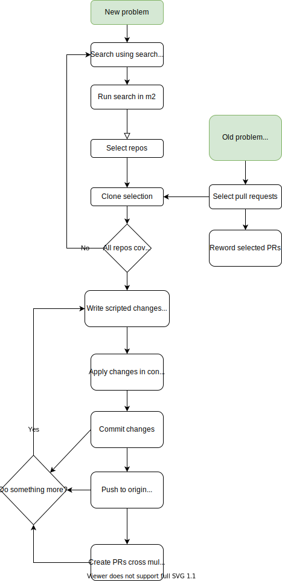

# Mega Manipulator (m²)

Search and replace as if the borders of repositories, code hosts, pull requests, or access control was as inconsequential as they ought to be.

<!--
Edit the flowchart using this link:
https://app.diagrams.net/#Hjensim%2Fmega-manipulator%2Fdocs%2Fmega-manipulator-overall.svg
-->

# Search
I currently support search using Sourcegraph, only OSS needed.

# Replace
Many approaches possible
* Using m²
  Scripted changes with output and exit code capture
* Use IntelliJ Search&Replace
* Any way you invent yourself
  the clones are on your filesystem

# Distribute change
Commit, Push, Fork, Pull request using m²

# Improve
Received feedback on PRs?  
Clone them and improve.  
Reword titles and body.

# Getting started

* [A quick tour of the GUI](getting_started)
* [Setting upp access](access)
